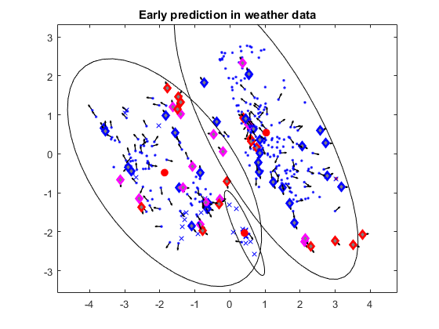

# Gaussian-Mixture-Model-for-Early-Detection
A Gaussian mixture model (GMM), coupled with possibilistic clustering is used to build an adaptive system for analyzing streaming multi-dimensional activity feature vector with the goal of identifying signs of early diseases. The system is based on temporal analysis, including outlier detection, customization and adaption to new changes, together with the creation of new components for GMM in the case of emerging new normal patterns. On the other hand, an alert will be fired when detecting unexpected behavior patterns. When dealing with streaming data from embedded sensors in an eldercare environment, every resident has their unique behavior pattern. Therefore, number of Gaussians for the GMM needs to be individually determined. For this reason, Sequential Possibilistic One-Means clustering algorithm is used to cluster the initial data points, detect anomalies and initialize the GMM. The system achieves our goals when tested on the real-world weather datasets, which is a collection of weather station nodes in the Le Genepi (LG) region in Switzerland. We hope that by applying the proposed system in real eldercare datasets, it will help by detecting health changes before real health issue happens.

(blue diamond: weak warning; magenta diamond: medium warning; red diamond: strong warning)

Note that this repository is only for demonstrating the ideas of multi-dimensional warning algorithms. You may do some changes (see comments in the code) to adapt the code to the new data.

Please visit https://ieeexplore.ieee.org/abstract/document/8858874 for more details of our paper. 

